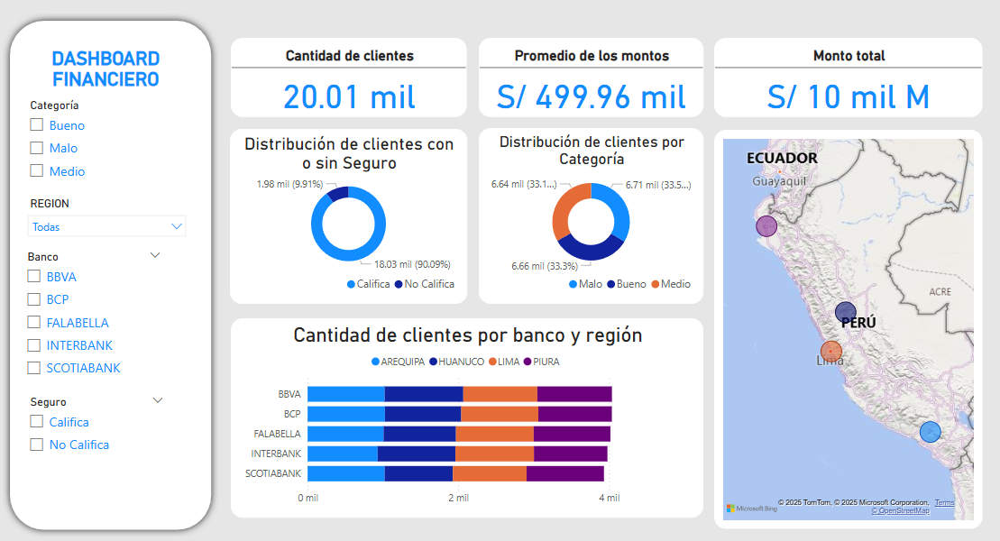

# Dashboard Financiero

Este proyecto consiste en un dashboard financiero que he desarrollado en Power BI. El objetivo es analizar la distribución de clientes, montos de transacciones y la relación entre bancos y regiones.
## Datos Utilizados
La base de datos usado de 20,009 filas incluyen los siguientes datos:
- Información de clientes (DNI, ID, nombres, edad, categoría).
- Datos financieros (monto de transacciones, banco asociado).
- Ubicación geográfica (región).
- Estado de seguro (Califica / No Califica).

## Características del Dashboard
- **Cantidad de clientes**: Total de clientes registrados en la base de datos.
- **Promedio de los montos**: Monto promedio de transacciones realizadas.
- **Monto total**: Suma de todas las transacciones financieras.
- **Distribución de clientes por seguro**: Diferenciación entre clientes que califican y los que no.
- **Distribución de clientes por categoría**: Clasificación de clientes en "Bueno", "Medio" y "Malo".
- **Cantidad de clientes por banco y región**: Comparación de la cantidad de clientes según el banco y su ubicación.
- **Mapa de distribución**: Ubicación geográfica de los clientes en Perú.

##  Vista Previa

## Conclusiones
- La mayoría de los clientes (90.09%) califican para un seguro, mientras que solo el 9.91% no califica, lo que indica que la mayoría tiene un perfil financiero estable.
- La distribución de clientes por categoría es equilibrada: 33.5% en "Bueno", 33.3% en "Medio" y 33.1% en "Malo", lo que muestra que el banco atiende a una variedad de perfiles sin concentrarse en un solo grupo.
- El promedio de los montos transaccionados es S/ 499.96 mil, y el monto total registrado en la base de datos es S/ 10 mil millones, reflejando operaciones de alto valor.
- Los bancos con mayor cantidad de clientes son BBVA y BCP, mientras que Falabella, Interbank y Scotiabank tienen una presencia menor.
- Las regiones con mayor concentración de clientes son Lima, Arequipa, Huánuco y Piura, siendo Lima la principal.
